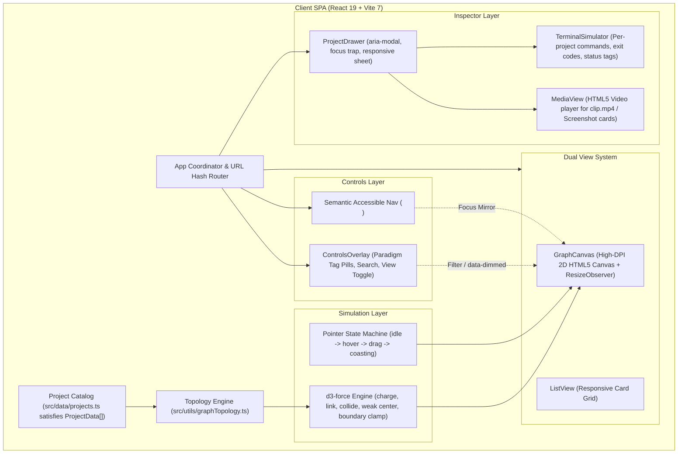

## Context

The portfolio is a greenfield single-page application built to showcase 6 real-world repositories with diverse runtimes (Python CLI, LaTeX engine, Express backend, geospatial rasters, Web Audio, Firefox extension). Grounded in the evidence from `research.md`, multiple sibling projects enforce CSP `frame-ancestors 'none'`, making live iframes unviable and necessitating dedicated presentation modes.

## System Architecture Diagram



## Goals / Non-Goals

**Goals:**
- Deliver an organic, decentralized 2D force graph using `d3-force` with uniform node radius (18px), uniform charge, weak centering (0.035), and soft boundary damping.
- Mitigate the OpenDungeon hub effect by setting link spring strength to a soft 0.05, preventing degree-5 node pull toward the centroid.
- Implement a robust pointer state machine (`idle -> hover -> drag -> coasting`) with dynamic `velocityDecay` (0.4 idle, 0.18 coasting) ensuring flings coast naturally without hover re-pinning killing momentum.
- Dynamically derive undirected graph edges at runtime from a controlled paradigm tag vocabulary, yielding a stable 9-edge topology.
- Provide an accessible project inspector drawer supporting a discriminated `Preview` union (`terminal`, `video`, `screenshot`, `linkout`).
- Implement an interactive client-side terminal simulator resolving per-project commands (`--help`, `--schema`, `--list`, `--lint`, or `npm test`) with captured exit codes.
- Provide full keyboard navigation with focus mirroring and an instant Graph / List View toggle.

**Non-Goals:**
- Live `<iframe>` embedding: Production CSP headers in sibling repos (`open-dungeon`, `sandwave-sim`) block framing. Replaced with video, screenshots, terminal emulation, and direct linkout buttons.
- Arbitrary client-side shell execution: Terminal simulation is deterministic and bound to registered project outputs.
- Heavyweight 3D WebGL runtimes: Pure 2D Canvas keeps bundle size under ~120KB gzipped.

## Decisions

### 1. Physics Tuning: Weak Centering + Strong Repulsion + Hub Softening
- **Choice**: Combine a strong repulsive charge $k_{charge} = -\min(w, h) \times 0.55$ (with `distanceMin = 50`) and a weak centering force `forceX(w/2).strength(0.035)`, `forceY(h/2).strength(0.035)`, backed by a soft edge-boundary safety net active only within 40px of canvas margins.
- **OpenDungeon Hub Mitigation**: OpenDungeon shares tags with all other 5 projects. Under standard d3 link strengths (`1 / min(degree)`), OD would be dragged into the center of the canvas, becoming an unwanted gravity hub. To guarantee equal visual weight, link strength is softened to `0.05` with a rest distance of 180px. Repulsion dominates, keeping OD buoyant alongside the others.
- **Resize Handling**: A `ResizeObserver` on the canvas container updates the centering targets (`w/2`, `h/2`), recalibrates charge strength, and reheats the simulation with `alpha(0.2).restart()`.

### 2. Pointer State Machine (`idle -> hover -> drag -> coasting`) & Dynamic Decay
- **Choice**: Track interaction states explicitly:
  - `idle`: Not dragging, not coasting. Hover detection runs. Moving over node $H$ pins it (`H.fx = H.x; H.fy = H.y`), sets `alphaTarget(0.15)`, and applies custom hover attraction force:
    $$F_{pull} = \alpha \times 0.08 \times (dist - 120)$$
    along the link vector to directly connected neighbors.
  - `hover`: Moving off $H$ unpins it and returns to `idle`. `pointerdown` on $H$ transitions to `drag`.
  - `drag`: Pointer down on node moves `fx/fy`. Hover detection is disabled for ALL nodes. Pointer velocities sampled over the last 3 moves.
  - `coasting`: On pointer up, velocity is injected into `node.vx/vy`, `sim.alpha(0.3).restart()` is called, and `velocityDecay` drops to `0.18`. Hover re-pinning on all nodes is suppressed until $\sqrt{vx^2 + vy^2} < 0.5\text{ px/tick}$, at which point `velocityDecay` restores to `0.4` and state returns to `idle`.
- **Rationale**: Resolves the fling cancellation defect where hover re-pinned the node immediately on pointer release, while preventing continuous oscillation during normal idle hover.

### 3. Controlled Paradigm Tag Vocabulary & Derived 9-Edge Graph
- **Choice**: Define a strict TypeScript union:
  ```ts
  export type ParadigmTag = 'LLM' | 'Express' | 'Vanilla JS' | 'Audio' | 'Agent Tooling' | 'LaTeX' | 'Geospatial' | 'WebExtension';
  ```
  Edges are formed if and only if two projects share a `ParadigmTag`.
  The exact 9 derived undirected edges are:
  1. `open-dungeon` <-> `pict-climate-risk-viz-chatbot` (`Express`, `LLM`)
  2. `open-dungeon` <-> `transcribe-plus` (`Express`, `Vanilla JS`)
  3. `open-dungeon` <-> `sandwave-sim` (`Vanilla JS`)
  4. `open-dungeon` <-> `attention-max` (`Vanilla JS`)
  5. `open-dungeon` <-> `agentic-resume-builder` (`Agent Tooling`)
  6. `pict-climate-risk-viz-chatbot` <-> `transcribe-plus` (`Express`)
  7. `transcribe-plus` <-> `sandwave-sim` (`Vanilla JS`, `Audio`)
  8. `transcribe-plus` <-> `attention-max` (`Vanilla JS`)
  9. `sandwave-sim` <-> `attention-max` (`Vanilla JS`)
- **Data verification**: Bundled in `src/data/projects.ts` using `satisfies ProjectData[]`, guaranteeing zero-overhead compile-time validation.

### 4. Accessible DOM Navigation, Focus Mirroring & Deep Linking
- **Choice**: Hidden semantic `<nav aria-label="Projects">` rendered in the DOM. When a user tabs to a project button, the canvas draws a high-contrast focus ring around the corresponding canvas node and smoothly pans the view. Pressing Enter opens the drawer.
- **Dimming**: When tag pills (OR-combined) or search filters are active, non-matching projects receive `data-dimmed="true"` on their semantic DOM elements.
- **Deep Linking**: `window.location.hash` matching `#/p/:id` opens the drawer on mount. Closing the drawer clears the hash. Unknown slugs are safely ignored.

## Risks / Trade-offs

- **[Fling Momentum Loss from Premature Settling]** → *Mitigation*: Setting dynamic `velocityDecay(0.18)` during coasting and reheating `alpha(0.3)` on release guarantees smooth gliding deceleration.
- **[Canvas Inaccessibility for Screen Readers]** → *Mitigation*: Accessible semantic DOM tree, `data-dimmed` attributes, visible focus mirroring, and a 1-click Graph / List View toggle.
- **[Stale CLI and Asset Content]** → *Mitigation*: `scripts/capture-demos.sh` copies `clip.mp4` and captures real outputs from local sibling repos, committed to git and never run in production build.
