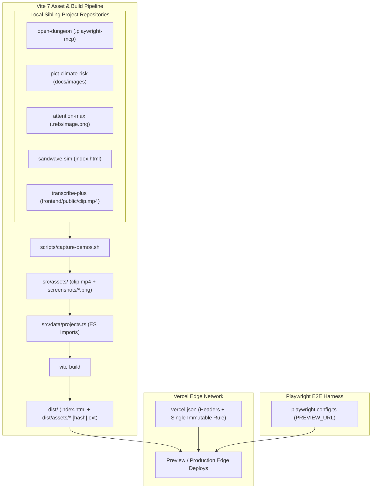

## Context

The `node-portfolio-graph` application is a client-side SPA built with React 19, TypeScript, and Vite 7, styled with Tailwind CSS v4. Following successful core physics and UI verification, the application must be deployed to Vercel's Edge CDN. Rather than treating deployment as an unconfigured default, this architecture establishes edge security headers, subresource caching, upload exclusion boundaries, social metadata, and authentic screenshot asset ingestion.

## System Architecture Diagram

## Goals / Non-Goals

**Goals:**
- Provide a clean, minimal `vercel.json` enforcing strict security headers (CSP without `'unsafe-inline'`, `X-Content-Type-Options`, `Referrer-Policy`, `Permissions-Policy`).
- Eliminate catch-all SPA rewrites (`rewrites: []`) to preserve authentic HTTP 404 behavior for missing files.
- Route all media through Vite's bundler pipeline so every asset in `dist/assets/` carries a content hash, enabling a single universal 1-year immutable cache header (`public, max-age=31536000, immutable`).
- Pin Node engine compatibility in `package.json` to `"node": "22.x"`.
- Replace placeholder title cards with 100% genuine screenshots extracted from sibling projects.
- Automate edge verification by supporting `PREVIEW_URL` in Playwright E2E tests.

**Non-Goals:**
- Server-side rendering (SSR) or edge compute middleware: the app remains a pure client-side SPA.
- Multi-page HTML routing: the application uses hash routing (`#/p/:id`), eliminating any need for server pushState rewrites.
- Managing custom DNS records or SSL certificates programmatically: domain assignment is managed in the Vercel dashboard.

## Decisions

### Decision 1: Zero-Rewrite Hash-Based Edge Routing
- **Choice**: Omit `"rewrites"` and `"cleanUrls"` entirely from `vercel.json`.
- **Rationale**: The portfolio navigation uses `window.location.hash` (`#/p/:id`), which browsers resolve client-side without sending path segments to the edge server. A catch-all rewrite (`/(.*) -> /index.html`) converts every 404 (missing favicon, typo'd asset URLs) into a `200 text/html` response, creating silent failures and breaking network diagnostics.
- **Alternatives Considered**: Retaining catch-all rewrite (rejected: breaks 404 contract).

### Decision 2: Universal Content-Hashed Asset Bundling via Vite
- **Choice**: Move `clip.mp4` and `screenshots/*.png` from `public/assets/` into `src/assets/`, importing them directly in `src/data/projects.ts`.
- **Rationale**: Vite automatically content-hashes all imported assets into `dist/assets/*-[hash].[ext]`. This removes the coexistence of hashed scripts with unhashed media in `dist/assets/`, allowing a single immutable caching rule (`/assets/(.*) -> max-age=31536000, immutable`) with zero risk of serving stale media on updates.
- **Alternatives Considered**: Keeping media in `public/media/` with short TTL (rejected: loses long-term CDN caching and atomic release guarantees).

### Decision 3: Strict CSP Without `'unsafe-inline'`
- **Choice**: Set `style-src 'self'` and remove `'unsafe-inline'`, `data:`, and `blob:`. Add `object-src 'none'`.
- **Rationale**: Tailwind CSS v4 compiles into an external stylesheet `index-*.css` without inline `<style>` tags. Dynamic style modifications in `GraphCanvas.tsx` operate through the CSSOM (`element.style.*`), which CSP does not restrict.
- **Alternatives Considered**: Permitting `'unsafe-inline'` for convenience (rejected: weakens XSS defense without technical justification).

### Decision 4: Node Engine Pinning to `22.x`
- **Choice**: Declare `"engines": { "node": "22.x" }` in `package.json`.
- **Rationale**: Vite 7 requires `^20.19.0 || >=22.12.0`. An open range like `>=20.0.0` allows incompatible Node 20 releases and triggers warnings on Vercel build infrastructure. Pinning to `22.x` mirrors the local development environment (Node 22.23) and guarantees compatibility.

### Decision 5: Authentic Sibling Screenshot Ingestion
- **Choice**: Sourcing real screenshots from sibling directories (`open-dungeon/.playwright-mcp/`, `pict-climate-risk-viz-chatbot/docs/images/`, `attention-max/.refs/`, and headless capture of `sandwave-sim/index.html`).
- **Rationale**: Synthetic title cards generated by `generate-screenshots.mjs` misrepresent application previews. Authentic captures ensure portfolio credibility.

## Risks / Trade-offs

- **[Risk]**: CSP `style-src 'self'` might block dynamic canvas style manipulation if third-party libraries inject inline `<style>` tags.
  - **Mitigation**: Verified Tailwind v4 build emits external CSS with 0 inline style tags; Playwright E2E suite verifies `zero console errors` against preview deployment.
- **[Risk]**: Large media files like `clip.mp4` (355 kB) increase bundle emission time.
  - **Mitigation**: Vite handles binary files via streaming copy with SHA-256 hashing; build takes under 4 seconds.
- **[Risk]**: Sibling project paths might not exist in external CI environments.
  - **Mitigation**: `scripts/capture-demos.sh` is an explicit maintainer tool run locally to populate committed `src/assets/`; production builds on Vercel run only `npm run build` using the committed assets.
